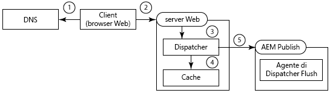
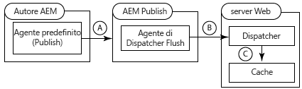
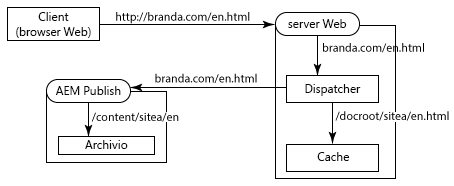
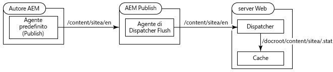
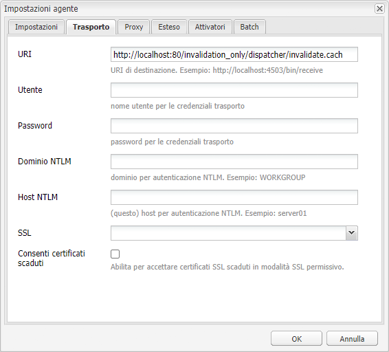
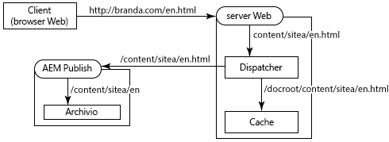
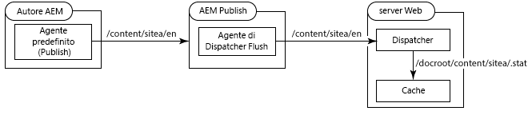
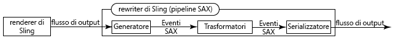
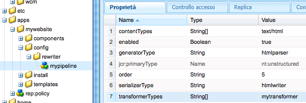

# Utilizzo di Dispatcher con più domini {#using-dispatcher-with-multiple-domains}

>[!NOTE]
>
>Le versioni di Dispatcher sono indipendenti da AEM. Puoi essere stato reindirizzato a questa pagina se hai seguito un collegamento alla documentazione di Dispatcher incorporata nella documentazione di AEM o CQ.

Utilizza Dispatcher per elaborare le richieste di pagine in più domini web e nel contempo supportare le seguenti condizioni:

* Il contenuto web di entrambi i domini viene memorizzato in un unico archivio AEM.
* I file nella cache di Dispatcher possono essere invalidati separatamente per ciascun dominio.

Ad esempio, un’azienda pubblica siti web per due dei propri marchi: Marchio A e Marchio B. Il contenuto delle pagine del sito web viene creato in AEM e memorizzato nello stesso spazio di lavoro dell’archivio:

```
/
| - content  
   | - sitea  
       | - content nodes  
   | - siteb  
       | - content nodes
```

Le pagine di `BrandA.com` sono memorizzate sotto `/content/sitea`. Le richieste dei client per l’URL `https://BrandA.com/en.html` vengono restituite alla pagina di cui è stato effettuato il rendering per il nodo `/content/sitea/en`. Analogamente, le pagine di `BrandB.com` sono memorizzate sotto `/content/siteb`.

Quando si utilizza Dispatcher per memorizzare in cache il contenuto, è necessario creare associazioni tra l’URL della pagina indicato nella richiesta HTTP del client, il percorso del file corrispondente nella cache e il percorso del file corrispondente nell’archivio.

## Richieste dei client

Quando i client inviano richieste HTTP al server web, l’URL della pagina richiesta deve essere risolto nel contenuto nella cache di Dispatcher e infine nel contenuto nell’archivio.



1. Il sistema dei nomi di dominio rileva l’indirizzo IP del server web registrato per il nome di dominio nella richiesta HTTP.
1. La richiesta HTTP viene inviata al server web.
1. La richiesta HTTP viene trasmessa a Dispatcher.
1. Dispatcher determina se i file memorizzati in cache sono validi. In caso affermativo, i file memorizzati in cache vengono trasmessi al client.
1. Se i file memorizzati in cache non sono validi, Dispatcher richiede all’istanza AEM Publish le pagine appena sottoposte a rendering.

## Annullamento della validità della cache

Quando gli agenti di replica Dispatcher Flush richiedono che Dispatcher invalidi i file memorizzati in cache, il percorso del contenuto nell’archivio deve essere risolto nel contenuto della cache.



* a - Viene attivata una pagina nell&#39;istanza di authoring AEM e il contenuto viene replicato nell&#39;istanza di pubblicazione.
* b: Dispatcher Flush Agent chiama Dispatcher per annullare la validità della cache per il contenuto replicato.
* c - Dispatcher tocca uno o più file .stat per annullare la validità dei file memorizzati nella cache.

Per utilizzare Dispatcher con più domini, devi configurare AEM, Dispatcher e il server web. Le soluzioni descritte in questa pagina sono generali e si applicano alla maggior parte degli ambienti. A causa della complessità di alcune topologie AEM, la soluzione può richiedere ulteriori configurazioni personalizzate per risolvere problemi particolari. È probabile che sarà necessario adattare gli esempi per soddisfare le policy di gestione e l’infrastruttura IT esistenti.

## Mapping degli URL {#url-mapping}

Per consentire agli URL del dominio e ai percorsi del contenuto di risolvere i file memorizzati in cache, a un certo punto del processo è necessario convertire il percorso di un file o l’URL di una pagina. Vengono fornite descrizioni delle seguenti strategie comuni, in cui le conversioni di percorsi o URL avvengono in punti diversi del processo:

* (Consigliata) L’istanza AEM Publish utilizza il mapping Sling per la risoluzione delle risorse per implementare le regole interne di riscrittura degli URL. Gli URL di dominio vengono convertiti in percorsi dell’archivio dei contenuti. Vedi [AEM riscrive gli URL in ingresso](#aem-rewrites-incoming-urls).
* Il server web utilizza le regole interne di riscrittura degli URL che convertono gli URL del dominio in percorsi di cache. Vedi [Il server web riscrive gli URL in ingresso](#the-web-server-rewrites-incoming-urls).

È generalmente consigliabile utilizzare URL brevi per le pagine web. Di solito, gli URL delle pagine rispecchiano la struttura delle cartelle dell’archivio, nelle quali è memorizzato il contenuto web. Tuttavia, gli URL non rivelano i nodi principali dell’archivio, come ad esempio `/content`. Il client non è necessariamente a conoscenza della struttura dell’archivio AEM.

## Requisiti generali {#general-requirements}

Per supportare il funzionamento di Dispatcher con più domini, il tuo ambiente deve implementare le seguenti configurazioni:

* Il contenuto di ciascun dominio risiede in settori separati dell’archivio (vedi l’esempio di ambiente riportato di seguito).
* L’agente di replica di Dispatcher Flush è configurato nell’istanza AEM Publish. (Vedi [Annullamento della validità della cache di Dispatcher da un’istanza Publish](page-invalidate.md).)
* Il sistema dei nomi di dominio risolve i nomi di dominio nell’indirizzo IP del server web.
* La cache di Dispatcher esegue il mirroring della struttura delle directory dell’archivio dei contenuti AEM. I percorsi dei file sotto la directory principale dei documenti del server web sono gli stessi dei percorsi dei file nell’archivio.

## Ambiente per gli esempi forniti {#environment-for-the-provided-examples}

Gli esempi di soluzioni fornite si applicano a un ambiente con le seguenti caratteristiche:

* Le istanze Autore AEM e AEM Publish sono distribuite sui sistemi Linux.
* Apache HTTPD è il server web implementato su un sistema Linux.
* L’archivio dei contenuti AEM e la directory principale dei documenti del server web utilizzano le seguenti strutture di file (la directory principale dei documenti del server web Apache è /`usr/lib/apache/httpd-2.4.3/htdocs)`:

   **Archivio**

```
  | - /content  
    | - sitea  
  |    | - content nodes
    | - siteb  
       | - content nodes
```

**Directory principale dei documenti del server web**

```
  | - /usr  
    | - lib  
      | - apache  
        | - httpd-2.4.3  
          | - htdocs  
            | - content  
              | - sitea  
                 | - content nodes 
              | - siteb  
                 | - content nodes
```

## AEM riscrive gli URL in ingresso {#aem-rewrites-incoming-urls}

Il mapping Sling per la risoluzione delle risorse consente di associare gli URL in ingresso ai percorsi del contenuto AEM. Crea mapping sull’istanza AEM Publish in modo che le richieste di rendering provenienti da Dispatcher vengano risolte nel contenuto corretto dell’archivio.

Le richieste di rendering di una pagina inviate da Dispatcher identificano la pagina utilizzando l’URL trasmesso dal server web. Quando l’URL include un nome di dominio, i mapping Sling risolvono l’URL nel contenuto. L’immagine che segue illustra un mapping dell’URL `branda.com/en.html` nel nodo `/content/sitea/en`.



La cache di Dispatcher esegue il mirroring della struttura dei nodi dell’archivio. Pertanto, quando si verificano attivazioni di pagine, le risultanti richieste di annullamento della validità della pagina memorizzata in cache non richiedono conversioni di URL o percorsi.



## Definizione degli host virtuali sul server web {#define-virtual-hosts-on-the-web-server}

Definisci gli host virtuali sul server web in modo che a ciascun dominio web possa essere assegnata una diversa directory principale dei documenti:

* Il server web deve definire un dominio virtuale per ciascuno dei tuoi domini web.
* Per ciascun dominio, configura la directory principale dei documenti in modo che coincida con la cartella di archivio, nella quale è memorizzato il contenuto web del dominio.
* Ciascun dominio virtuale deve includere anche configurazioni relative a Dispatcher, come descritto nella pagina [Installazione di Dispatcher](dispatcher-install.md).

Il seguente file di esempio `httpd.conf` configura due domini virtuali per un server web Apache:

* I nomi dei server (che coincidono con i nomi dei domini) sono branda.com (riga 16) e brandb.com (riga 30).
* La directory principale dei documenti di ciascun dominio virtuale è la directory nella cache di Dispatcher che contiene le pagine del sito (righe 17 e 31).

Con questa configurazione, il server web esegue le azioni sotto indicate quando riceve una richiesta per `https://branda.com/en/products.html`:

* Associa l’URL all’host virtuale il cui `ServerName` è `branda.com.`

* Inoltra l’URL a Dispatcher.

### httpd.conf {#httpd-conf}

```xml
# load the Dispatcher module
LoadModule dispatcher_module modules/mod_dispatcher.so
# configure the Dispatcher module
<IfModule disp_apache2.c>
 DispatcherConfig conf/dispatcher.any
 DispatcherLog    logs/dispatcher.log  
 DispatcherLogLevel 3
 DispatcherNoServerHeader 0 
 DispatcherDeclineRoot 0
 DispatcherUseProcessedURL 0
 DispatcherPassError 0
</IfModule>

# Define virtual host for brandA.com
<VirtualHost *:80>
  ServerName branda.com
  DocumentRoot /usr/lib/apache/httpd-2.4.3/htdocs/content/sitea
   <Directory /usr/lib/apache/httpd-2.4.3/htdocs/content/sitea>
     <IfModule disp_apache2.c>
       SetHandler dispatcher-handler
       ModMimeUsePathInfo On
     </IfModule>
     Options FollowSymLinks
     AllowOverride None
   </Directory>
</VirtualHost>

# define virtual host for brandB.com
<VirtualHost *:80>
  ServerName brandB.com
  DocumentRoot /usr/lib/apache/httpd-2.4.3/htdocs/content/siteb
   <Directory /usr/lib/apache/httpd-2.4.3/htdocs/content/siteb>
     <IfModule disp_apache2.c>
       SetHandler dispatcher-handler
       ModMimeUsePathInfo On
     </IfModule>
     Options FollowSymLinks
     AllowOverride None
   </Directory>
</VirtualHost>

# document root for web server
DocumentRoot "/usr/lib/apache/httpd-2.4.3/htdocs"
```

Considera che gli host virtuali ereditano il valore della proprietà [DispatcherConfig](dispatcher-install.md#main-pars-67-table-7) configurato nella sezione server principale. Gli host virtuali possono includere la propria proprietà DispatcherConfig per ignorare la configurazione del server principale.

### Configurazione di Dispatcher per la gestione di più domini {#configure-dispatcher-to-handle-multiple-domains}

Per supportare gli URL che includono i nomi di dominio e i corrispondenti host virtuali, definisci le seguenti farm di Dispatcher:

* Configura una farm di Dispatcher per ciascun host virtuale. Queste farm elaborano le richieste provenienti dal server web per ciascun dominio, verificano i file memorizzati in cache e richiedono le pagine dai rendering.
* Configura una farm di Dispatcher da utilizzare per invalidare il contenuto della cache, indipendentemente dal dominio a cui appartiene il contenuto. Questa farm gestisce le richieste di annullamento della validità dei file da parte degli agenti di replica di Dispatcher Flush.

### Creazione delle farm di Dispatcher per gli host virtuali

Le farm per gli host virtuali devono avere le seguenti configurazioni in modo che gli URL riportati nelle richieste HTTP dei client vengano risolti nei file corretti nella cache di Dispatcher:

* La proprietà `/virtualhosts` viene impostata sul nome di dominio. Questa proprietà consente a Dispatcher di associare la farm al dominio.
* La proprietà `/filter` consente di accedere al percorso dell’URL della richiesta troncato dopo la parte del nome di dominio. Ad esempio, nell’URL `https://branda.com/en.html`, il percorso viene interpretato come `/en.html`, pertanto il filtro deve consentire l’accesso a questo percorso.

* La proprietà `/docroot` viene impostata sul percorso della directory principale del contenuto del sito del dominio nella cache di Dispatcher. Questo percorso viene utilizzato come prefisso per l’URL concatenato della richiesta originale. Ad esempio, la directory principale dei documenti `/usr/lib/apache/httpd-2.4.3/htdocs/sitea` causa la risoluzione della richiesta di `https://branda.com/en.html` nel file `/usr/lib/apache/httpd-2.4.3/htdocs/sitea/en.html`.

Inoltre, l’istanza AEM Publish deve essere designata come rendering per l’host virtuale. Configura altre proprietà della farm come richiesto. Il codice che segue è una configurazione abbreviata della farm per il dominio branda.com:

```xml
/farm_sitea  {     
    ...
    /virtualhosts { "branda.com" }
    /renders {
      /rend01  { /hostname "127.0.0.1"  /port "4503" }
    }
    /filter {
      /0001 { /type "deny"  /glob "*" }
      /0023 { /type "allow" /glob "*/en*" }  
      ...
     }
    /cache {
      /docroot "/usr/lib/apache/httpd-2.4.3/htdocs/content/sitea"
      ...
   }
   ...
}
```

### Creazione di una farm di Dispatcher per l’annullamento della validità della cache

È necessaria una farm di Dispatcher per gestire le richieste di annullamento della validità dei file memorizzati in cache. Questa farm deve essere in grado di accedere ai file .stat nelle directory principali dei documenti di ciascun host virtuale.

Le seguenti configurazioni di proprietà consentono a Dispatcher di risolvere i file nell’archivio dei contenuti AEM dai file memorizzati in cache:

* La proprietà `/docroot` viene impostata sulla directory principale dei documenti predefinita del server web. In genere, si tratta della directory in cui viene creata la cartella `/content`. Un esempio di valore per Apache su Linux è `/usr/lib/apache/httpd-2.4.3/htdocs`.
* La proprietà `/filter` consente l’accesso ai file sotto la directory `/content`.

La proprietà `/statfileslevel`deve essere sufficientemente alta in modo che i file .stat vengano creati nella directory principale di ciascun host virtuale. Questa proprietà consente di invalidare separatamente la cache di ciascun dominio. Nell’esempio di configurazione, con un valore di `/statfileslevel` impostato su `2`, vengono creati file .stat nella directory `*docroot*/content/sitea` e nella directory `*docroot*/content/siteb`.

Inoltre, l’istanza Publish deve essere designata come rendering per l’host virtuale. Configura altre proprietà della farm come richiesto. Il codice che segue è una configurazione abbreviata della farm utilizzata per invalidare la cache:

```xml
/farm_flush {  
    ...
    /virtualhosts   { "invalidation_only" }
    /renders  {
      /rend01  { /hostname "127.0.0.1" /port "4503" }
    }
    /filter   {
      /0001 { /type "deny"  /glob "*" }
      /0023 { /type "allow" /glob "*/content*" } 
      ...
      }
    /cache  {
       /docroot "/usr/lib/apache/httpd-2.4.3/htdocs"
       /statfileslevel "2"
       ...
   }
   ...
}
```

Quando si avvia il server web, il registro di Dispatcher (in modalità di debug) indica l’inizializzazione di tutte le farm:

```shell
Dispatcher initializing (build 4.1.2)
[Fri Nov 02 16:27:18 2012] [D] [24974(140006182991616)] farms[farm_sitea].cache.docroot = /usr/lib/apache/httpd-2.4.3/htdocs/content/sitea
[Fri Nov 02 16:27:18 2012] [D] [24974(140006182991616)] farms[farm_siteb].cache.docroot = /usr/lib/apache/httpd-2.4.3/htdocs/content/siteb
[Fri Nov 02 16:27:18 2012] [D] [24974(140006182991616)] farms[farm_flush].cache.docroot = /usr/lib/apache/httpd-2.4.3/htdocs
[Fri Nov 02 16:27:18 2012] [I] [24974(140006182991616)] Dispatcher initialized (build 4.1.2)
```

### Configurazione del mapping Sling per la risoluzione delle risorse {#configure-sling-mapping-for-resource-resolution}

Utilizza il mapping Sling per la risoluzione delle risorse in modo che gli URL basati sul dominio possano risolvere il contenuto nell’istanza AEM Publish. Il mapping delle risorse converte gli URL in ingresso da Dispatcher (originariamente dalle richieste HTTP dei client) ai nodi di contenuto.

Per informazioni sul mapping delle risorse Sling, vedi [Mapping per la risoluzione delle risorse](https://sling.apache.org/site/mappings-for-resource-resolution.html) nella documentazione di Sling.

In genere, i mapping sono necessari per le risorse seguenti, sebbene possano essere necessarie mapping aggiuntivi:

* Il nodo principale della pagina del contenuto (sotto `/content`)
* Il nodo di progettazione utilizzato dalle pagine (sotto `/etc/designs`)
* La cartella `/libs`

Dopo aver creato il mapping per la pagina del contenuto, utilizza un browser web per aprire una pagina sul server web e scoprire i mapping aggiuntivi richiesti. Nel file error.log dell’istanza Publish, individua i messaggi relativi alle risorse che non sono state trovate. Il seguente esempio di messaggio indica che è necessario un mapping per `/etc/clientlibs`:

```shell
01.11.2012 15:59:24.601 *INFO* [10.36.34.243 [1351799964599] GET /etc/clientlibs/foundation/jquery.js HTTP/1.1] org.apache.sling.engine.impl.SlingRequestProcessorImpl service: Resource /content/sitea/etc/clientlibs/foundation/jquery.js not found
```

>[!NOTE]
>
>Il trasformatore linkchecker del rewriter predefinito di Apache Sling modifica automaticamente i collegamenti ipertestuali nella pagina per evitare collegamenti interrotti. Tuttavia, la riscrittura dei collegamenti viene eseguita solo quando la destinazione del collegamento è un file HTML o HTM. Per aggiornare i collegamenti ad altri tipi di file, crea un componente di trasformazione e aggiungilo a una pipeline del rewriter HTML.

### Esempio di nodi di mapping delle risorse

Nella tabella che segue sono elencati i nodi che implementano il mapping delle risorse per il dominio branda.com. Nodi simili vengono creati per il dominio `brandb.com`, ad esempio `/etc/map/http/brandb.com`. In tutti i casi, i mapping sono necessari quando i riferimenti contenuti nel codice HTML della pagina non vengono risolti correttamente nel contesto di Sling.

| Percorso del nodo | Tipo | Proprietà |
|--- |--- |--- |
| `/etc/map/http/branda.com` | sling:Mapping | Nome: sling:internalRedirect Tipo: Valore stringa: /content/sitea |
| `/etc/map/http/branda.com/libs` | sling:Mapping | Nome: sling:internalRedirect <br/>Tipo: String <br/>Valore: /libs |
| `/etc/map/http/branda.com/etc` | sling:Mapping |  |
| `/etc/map/http/branda.com/etc/designs` | sling:Mapping | Nome: sling:internalRedirect <br/>TipoV: String <br/>ValoreV: /etc/designs |
| `/etc/map/http/branda.com/etc/clientlibs` | sling:Mapping | Nome: sling:internalRedirect <br/>TipoV: String <br/>ValoreV: /etc/clientlibs |

## Configurazione dell’agente di replica di Dispatcher Flush {#configuring-the-dispatcher-flush-replication-agent}

L’agente di replica di Dispatcher Flush nell’istanza AEM Publish deve inviare richieste di annullamento della validità alla farm di Dispatcher corretta. Per individuare la farm corretta, utilizza la proprietà URI dell’agente di replica di Dispatcher Flush (nella scheda Trasporto). Includi il valore della proprietà `/virtualhost` per la farm di Dispatcher configurata per invalidare la cache:

`https://*webserver_name*:*port*/*virtual_host*/dispatcher/invalidate.cache`

Ad esempio, per utilizzare la farm `farm_flush` dell’esempio precedente, l’URI è `https://localhost:80/invalidation_only/dispatcher/invalidate.cache`.



## Il server web riscrive gli URL in ingresso {#the-web-server-rewrites-incoming-urls}

Utilizza la funzione di riscrittura URL interna del server web per convertire gli URL di dominio in percorsi di file nella cache di Dispatcher. Ad esempio, le richieste dei client per la pagina `https://brandA.com/en.html` vengono convertite nel file `content/sitea/en.html` nella directory principale dei documenti del server web.



La cache di Dispatcher esegue il mirroring della struttura dei nodi dell’archivio. Pertanto, quando si verificano attivazioni di pagine, le risultanti richieste di annullamento della validità della pagina memorizzata in cache non richiedono conversioni di URL o percorsi.



## Definizione degli host virtuali e delle regole di riscrittura sul server web {#define-virtual-hosts-and-rewrite-rules-on-the-web-server}

Configura i seguenti aspetti sul server web:

* Definisci un host virtuale per ciascuno dei tuoi domini web.
* Per ciascun dominio, configura la directory principale dei documenti in modo che coincida con la cartella di archivio, nella quale è memorizzato il contenuto web del dominio.
* Per ciascun dominio virtuale, crea una regola di ridenominazione URL che converta l’URL in ingresso nel percorso del file memorizzato in cache.
* Ciascun dominio virtuale deve includere anche configurazioni relative a Dispatcher, come descritto nella pagina [Installazione di Dispatcher](dispatcher-install.md).
* Il modulo Dispatcher deve essere configurato per utilizzare l’URL riscritto dal server web. (Vedi la proprietà `DispatcherUseProcessedURL` in [Installazione di Dispatcher](dispatcher-install.md).)

Il seguente esempio di file httpd.conf configura due host virtuali per un server web Apache:

* I nomi dei server (che coincidono con i nomi di dominio) sono `brandA.com` (riga 16) e `brandB.com` (riga 32).

* La directory principale dei documenti di ciascun dominio virtuale è la directory nella cache di Dispatcher che contiene le pagine del sito (righe 20 e 33).
* La regola di riscrittura URL per ciascun dominio virtuale è un’espressione regolare che aggiunge il percorso delle pagine nella cache come prefisso del percorso della pagina richiesta (righe 19 e 35).
* La proprietà `DispatherUseProcessedURL` è impostata su `1`. (riga 10).

Ad esempio, il server web esegue le seguenti azioni sotto indicate quando riceve una richiesta con l’URL `https://brandA.com/en/products.html`:

* Associa l’URL all’host virtuale il cui `ServerName` è `brandA.com.`
* Riscrive l’URL come `/content/sitea/en/products.html.`
* Inoltra l’URL a Dispatcher.

### httpd.conf {#httpd-conf-1}

```xml
# load the Dispatcher module
LoadModule dispatcher_module modules/mod_dispatcher.so
# configure the Dispatcher module
<IfModule disp_apache2.c>
 DispatcherConfig conf/dispatcher.any
 DispatcherLog    logs/dispatcher.log  
 DispatcherLogLevel 3
 DispatcherNoServerHeader 0 
 DispatcherDeclineRoot 0
 DispatcherUseProcessedURL 1
 DispatcherPassError 0
</IfModule>

# Define virtual host for brandA.com
<VirtualHost *:80>
  ServerName branda.com
  DocumentRoot /usr/lib/apache/httpd-2.4.3/htdocs/content/sitea
  RewriteEngine  on
  RewriteRule    ^/(.*)\.html$  /content/sitea/$1.html [PT]
   <Directory /usr/lib/apache/httpd-2.4.3/htdocs/content/sitea>
     <IfModule disp_apache2.c>
       SetHandler dispatcher-handler
       ModMimeUsePathInfo On
     </IfModule>
     Options FollowSymLinks
     AllowOverride None
   </Directory>
</VirtualHost>

# define virtual host for brandB.com
<VirtualHost *:80>
  ServerName brandB.com
  DocumentRoot /usr/lib/apache/httpd-2.4.3/htdocs/content/siteb
  RewriteEngine  on
  RewriteRule    ^/(.*)\.html$  /content/siteb/$1.html [PT]
   <Directory /usr/lib/apache/httpd-2.4.3/htdocs/content/siteb>
     <IfModule disp_apache2.c>
       SetHandler dispatcher-handler
       ModMimeUsePathInfo On
     </IfModule>
     Options FollowSymLinks
     AllowOverride None
   </Directory>
</VirtualHost>

# document root for web server
DocumentRoot "/usr/lib/apache/httpd-2.4.3/htdocs"
```

### Configurazione di una farm di Dispatcher {#configure-a-dispatcher-farm}

Quando il server web riscrive gli URL, Dispatcher richiede una singola farm definita in base a quanto riportato in [Configurazione di Dispatcher](dispatcher-configuration.md). Per supportare gli host virtuali del server web e le regole di ridenominazione degli URL sono necessarie le seguenti configurazioni:

* La proprietà `/virtualhosts` deve includere i valori ServerName per tutte le definizioni VirtualHost.
* La proprietà `/statfileslevel` deve essere sufficientemente alta per creare i file .stat nelle directory che contengono i file del contenuto di ciascun dominio.

Il seguente file di configurazione di esempio si basa sul file di esempio `dispatcher.any` che viene installato con Dispatcher. Per supportare le configurazioni del server web del file `httpd.conf` precedente sono necessarie le seguenti modifiche:

* La proprietà `/virtualhosts` consente a Dispatcher di gestire le richieste per i domini `brandA.com` e `brandB.com`. (riga 12).
* La proprietà `/statfileslevel` è impostata su 2, in modo che i file .stat vengano creati in ciascuna directory che contiene il contenuto web del dominio (riga 41): `/statfileslevel "2"`

Come sempre, la directory principale dei documenti nella cache è la stessa della directory principale dei documenti sul server web (riga 40): `/usr/lib/apache/httpd-2.4.3/htdocs`

### `dispatcher.any` {#dispatcher-any}

```xml
/name "testDispatcher"
/farms
  {
  /dispfarm0
    {  
    /clientheaders
      {
      "*"
      }      
    /virtualhosts
      {
      "brandA.com" "brandB.com"
      }
    /renders
      {
      /rend01    {  /hostname "127.0.0.1"   /port "4503"  }
      }
    /filter
      {
      /0001 { /type "deny"  /glob "*" }
      /0023 { /type "allow" /glob "*/content*" }  # disable this rule to allow mapped content only
      /0041 { /type "allow" /glob "* *.css *"   }  # enable css
      /0042 { /type "allow" /glob "* *.gif *"   }  # enable gifs
      /0043 { /type "allow" /glob "* *.ico *"   }  # enable icos
      /0044 { /type "allow" /glob "* *.js *"    }  # enable javascript
      /0045 { /type "allow" /glob "* *.png *"   }  # enable png
      /0046 { /type "allow" /glob "* *.swf *"   }  # enable flash
      /0061 { /type "allow" /glob "POST /content/[.]*.form.html" }  # allow POSTs to form selectors under content
      /0062 { /type "allow" /glob "* /libs/cq/personalization/*"  }  # enable personalization
      /0081 { /type "deny"  /glob "GET *.infinity.json*" }
      /0082 { /type "deny"  /glob "GET *.tidy.json*"     }
      /0083 { /type "deny"  /glob "GET *.sysview.xml*"   }
      /0084 { /type "deny"  /glob "GET *.docview.json*"  }
      /0085 { /type "deny"  /glob "GET *.docview.xml*"  }      
      /0086 { /type "deny"  /glob "GET *.*[0-9].json*" }
      /0090 { /type "deny"  /glob "* *.query.json*" }
      }
    /cache
      {
      /docroot "/usr/lib/apache/httpd-2.4.3/htdocs"
      /statfileslevel "2"
      /allowAuthorized "0"
      /rules
        {
        /0000  { /glob "*"     /type "allow"  }
        }
      /invalidate
        {
        /0000  {   /glob "*" /type "deny"  }
        /0001 {  /glob "*.html" /type "allow"  }
        }
      /allowedClients
        {
        }     
      }
    /statistics
      {
      /categories
        {
        /html  { /glob "*.html" }
        /others  {  /glob "*"  }
        }
      }
    }
  }
```

>[!NOTE]
>
>Poiché è definita una sola farm di Dispatcher, l’agente di replica Dispatcher Flush sull’istanza AEM Publish non richiede configurazioni speciali.

## Riscrittura dei collegamenti ai file non HTML {#rewriting-links-to-non-html-files}

Per riscrivere i riferimenti ai file con estensioni diverse da .html o .htm, crea un componente trasformatore del rewriter Sling e aggiungilo alla pipeline predefinita del rewriter.

Riscrivi i riferimenti nel caso in cui i percorsi delle risorse non vengano risolti correttamente nel contesto del server web. Ad esempio, è necessario un trasformatore quando i componenti che generano immagini creano collegamenti del tipo /content/sitea/en/products.navimage.png. Il componente topnav indicato ini [Come creare un sito web Internet completo](https://helpx.adobe.com/it/experience-manager/6-5/sites/developing/using/the-basics.html) crea questi collegamenti.

Il [rewriter di Sling](https://sling.apache.org/documentation/bundles/output-rewriting-pipelines-org-apache-sling-rewriter.html) è un modulo che esegue la post-elaborazione dell’output di Sling. Le implementazioni della pipeline SAX del rewriter sono costituite da un generatore, uno o più trasformatori e un serializzatore:

* **Generatore:** analizza il flusso di output di Sling (documento HTML) e genera eventi SAX quando incontra tipi di elementi specifici.
* **Trasformatore:** ascolta gli eventi SAX e modifica di conseguenza la destinazione dell’evento (un elemento HTML). Una pipeline del rewriter contiene zero o più trasformatori. I trasformatori vengono eseguiti in sequenza, trasferendo gli eventi SAX al successivo trasformatore nella sequenza.
* **Serializzatore:** serializza l’output, incluse le modifiche apportate da ciascun trasformatore.



### Pipeline predefinita del rewriter di AEM {#the-aem-default-rewriter-pipeline}

AEM utilizza una pipeline predefinita del rewriter che elabora documenti di tipo testo/html:

* Il generatore analizza i documenti HTML e genera eventi SAX quando incontra elementi di tipo img, area, form, base, link, script e body. L’alias del generatore è `htmlparser`.
* La pipeline include i seguenti trasformatori: `linkchecker`, `mobile`, `mobiledebug`, `contentsync`. Il trasformatore `linkchecker` esternalizza i percorsi ai file HTML o HTM di riferimento per evitare collegamenti interrotti.
* Il serializzatore scrive l’output HTML. L’alias del serializzatore è htmlwriter.

Il nodo `/libs/cq/config/rewriter/default` definisce la pipeline.

### Creazione di un trasformatore {#creating-a-transformer}

Per creare un componente trasformatore e utilizzarlo in una pipeline, fai quanto segue:

1. Implementa l’interfaccia `org.apache.sling.rewriter.TransformerFactory`. Questa classe crea istanze della classe transformer. Specifica i valori per la proprietà `transformer.type` (l’alias del trasformatore) e configura la classe come componente del servizio OSGi.
1. Implementa l’interfaccia `org.apache.sling.rewriter.Transformer`. Per ridurre al minimo il lavoro, puoi estendere la classe `org.apache.cocoon.xml.sax.AbstractSAXPipe`. Ignora il metodo startElement per personalizzare il comportamento di riscrittura. Questo metodo viene richiamato per ogni evento SAX trasferito al trasformatore.
1. Crea il bundle e distribuisci le classi.
1. Aggiungi un nodo di configurazione all’applicazione AEM per aggiungere il trasformatore alla pipeline.

>[!TIP]
>In alternativa, puoi anche configurare TransformerFactory in modo che il trasformatore sia inserito in ogni rewriter definito. Di conseguenza, non è necessario configurare una pipeline:
>
>* Imposta la proprietà `pipeline.mode` su `global`.
>* Imposta la proprietà `service.ranking` su un numero intero positivo.
>* Non includere una proprietà `pipeline.type`.


>[!NOTE]
>
>Utilizza l’archetipo [multimodule](https://helpx.adobe.com/it/experience-manager/aem-previous-versions.html) del Content Package Maven Plugin per creare il tuo progetto Maven. I POM creano e installano automaticamente un pacchetto di contenuti.

I seguenti esempi implementano un trasformatore che riscrive i riferimenti nei file di immagine.

* La classe MyRewriterTransformerFactory crea istanze di oggetti MyRewriterTransformer. La proprietà pipeline.type imposta l’alias del trasformatore su mytransformer. Per includere l’alias in una pipeline, il nodo di configurazione della pipeline lo include nell’elenco dei trasformatori.
* La classe MyRewriterTransformer sostituisce il metodo startElement della classe AbstractSAXTransformer. Il metodo startElement riscrive il valore degli attributi src per gli elementi img.

Gli esempi non sono totalmente affidabili e non vanno utilizzati in un ambiente di produzione.

### Esempio di implementazione di TransformerFactory {#example-transformerfactory-implementation}

```java
package com.adobe.example;

import org.apache.felix.scr.annotations.Component;
import org.apache.felix.scr.annotations.Service;
import org.apache.felix.scr.annotations.Property;

import org.apache.sling.rewriter.Transformer;
import org.apache.sling.rewriter.TransformerFactory;

@Component
@Service
public class MyRewriterTransformerFactory implements TransformerFactory {
    /* Define the alias */
    @Property(value="mytransformer")
    static final String PIPELINE_TYPE ="pipeline.type";
 
    public Transformer createTransformer() {
        
        return new MyRewriterTransformer ();
    }
}
```

### Esempio di implementazione di un trasformatore {#example-transformer-implementation}

```java
package com.adobe.example;

import java.io.IOException;

import org.apache.cocoon.xml.sax.AbstractSAXPipe;

import org.apache.sling.api.SlingHttpServletRequest;
import org.apache.sling.rewriter.ProcessingComponentConfiguration;
import org.apache.sling.rewriter.ProcessingContext;
import org.apache.sling.rewriter.Transformer;

import org.slf4j.Logger;
import org.slf4j.LoggerFactory;

import org.xml.sax.Attributes;
import org.xml.sax.SAXException;
import org.xml.sax.helpers.AttributesImpl;

import javax.servlet.http.HttpServletRequest;

public class MyRewriterTransformer extends AbstractSAXPipe implements Transformer {

 private static final Logger log = LoggerFactory.getLogger(MyRewriterTransformer.class);
 private SlingHttpServletRequest httpRequest; 
 /* The element and attribute to act on  */
 private static final String ATT_NAME = new String("src");
 private static final String EL_NAME = new String("img");

 public MyRewriterTransformer () {
 }
 public void dispose() {
 }
 public void init(ProcessingContext context, ProcessingComponentConfiguration config) throws IOException {
  this.httpRequest = context.getRequest();
  log.debug("Transforming request {}.", httpRequest.getRequestURI());
 }
 @Override
 public void startElement (String nsUri, String localname, String qname, Attributes atts) throws SAXException {
  /* copy the element attributes */
  AttributesImpl linkAtts = new AttributesImpl(atts); 
  /* Only interested in EL_NAME elements */
  if(EL_NAME.equalsIgnoreCase(localname)){

   /* iterate through the attributes of the element and act only on ATT_NAME attributes */
   for (int i=0; i < linkAtts.getLength(); i++) {
    if (ATT_NAME.equalsIgnoreCase(linkAtts.getLocalName(i))) {
     String path_in_link = linkAtts.getValue(i);

     /* use the resource resolver of the http request to reverse-resolve the path  */
     String mappedPath = httpRequest.getResourceResolver().map(httpRequest, path_in_link);

     log.info("Tranformed {} to {}.", path_in_link,mappedPath);

     /* update the attribute value */
     linkAtts.setValue(i,mappedPath);
    }
   }

  }
        /* return updated attributes to super and continue with the transformer chain */
 super.startElement(nsUri, localname, qname, linkAtts);
 }
}
```

### Aggiunta del trasformatore a una pipeline del rewriter {#adding-the-transformer-to-a-rewriter-pipeline}

Crea un nodo JCR che definisce una pipeline che utilizza il tuo trasformatore. La seguente definizione del nodo crea una pipeline che elabora file di testo/html. Vengono utilizzati il generatore e il parser predefiniti di AEM per HTML.

>[!NOTE]
>
>Se imposti la proprietà `pipeline.mode` del trasformatore su `global`, non è necessario configurare una pipeline. La modalità `global` inserisce il trasformatore in tutte le pipeline.

### Nodo di configurazione del rewriter: rappresentazione XML {#rewriter-configuration-node-xml-representation}

```xml
<?xml version="1.0" encoding="UTF-8"?>
<jcr:root xmlns:jcr="https://www.jcp.org/jcr/1.0" xmlns:nt="https://www.jcp.org/jcr/nt/1.0"
    jcr:primaryType="nt:unstructured"
    contentTypes="[text/html]"
    enabled="{Boolean}true"
    generatorType="htmlparser"
    order="5"
    serializerType="htmlwriter"
    transformerTypes="[mytransformer]">
</jcr:root>
```

La figura che segue mostra la rappresentazione CRXDE Lite del nodo:


