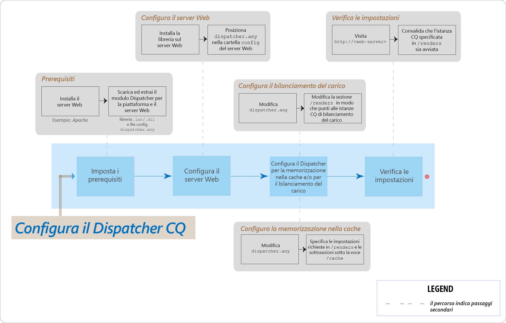

# Domande frequenti sui principali problemi di AEM Dispatcher



## Introduzione

### Cos’è Dispatcher?

Il Dispatcher è uno strumento di caching e/o bilanciamento del carico di Adobe Experience Manager che consente di realizzare un ambiente di authoring web veloce e dinamico. Per il caching, il Dispatcher funziona come parte di un server HTTP, come Apache. Ha lo scopo di archiviare (o “memorizzare in cache”) il più possibile del contenuto statico del sito web, limitando gli accessi al motore di layout del sito web. In un ruolo di bilanciamento del carico, il Dispatcher distribuisce le richieste degli utenti (carico) tra le diverse istanze AEM (rendering).

Per il caching, il modulo Dispatcher utilizza la funzionalità del server web che consente di gestire il contenuto statico. Dispatcher inserisce i documenti memorizzati in cache nella directory principale dei documenti del server web.

### Come viene eseguito il caching in Dispatcher?

Dispatcher utilizza la funzionalità del server web che consente di gestire il contenuto statico. Il Dispatcher archivia i documenti memorizzati in cache nella radice del documento del server web. In Dispatcher sono disponibili due metodi principali per aggiornare il contenuto della cache quando vengono apportate modifiche al sito web.

* **Aggiornamenti del contenuto**: le pagine modificate e i file che sono direttamente associati ad esse vengono rimossi.
* **Annullamento automatico della validità**: le parti della cache che potrebbero risultare obsolete dopo un aggiornamento vengono invalidate automaticamente. Ad esempio, le pagine ritenute obsolete vengono chiaramente contrassegnate, ma non eliminate.

### Quali sono i vantaggi del bilanciamento del carico?

Il bilanciamento del carico distribuisce le richieste degli utenti (carico) nelle diverse istanze AEM. L’elenco seguente descrive i vantaggi del bilanciamento del carico:

* **Maggiore potenza di elaborazione**: in pratica, questo metodo fa sì che il Dispatcher condivida le richieste di documenti tra le diverse istanze AEM. Poiché ciascuna istanza ha meno documenti da elaborare, i tempi di risposta sono più rapidi. Dispatcher mantiene statistiche interne per ogni categoria di documenti, in modo da poter stimare il carico e distribuire le query in modo efficiente.
* **Maggiore copertura in caso di errore**: se il Dispatcher non riceve risposte da un’istanza, inoltra automaticamente le richieste a una delle altre istanze. Pertanto, se un’istanza risulta non disponibile, l’unico effetto è un rallentamento del sito, proporzionato alla potenza di elaborazione persa.

>[!NOTE]
>
>Per ulteriori dettagli, vedi la [pagina Panoramica di Dispatcher](dispatcher.md)

## Installazione e configurazione

### Da dove posso scaricare il modulo Dispatcher?

Puoi scaricare il più recente modulo Dispatcher dalla pagina [Note sulla versione di Dispatcher](release-notes.md).

### Come si installa il modulo Dispatcher?

Visita la pagina [Installazione di Dispatcher](dispatcher-install.md).

### Come si configura il modulo Dispatcher?

Visita la pagina [Configurazione di Dispatcher](dispatcher-configuration.md).

### Come si configura Dispatcher per l’istanza Autore?

Per i passaggi dettagliati, vedi [Utilizzo di Dispatcher con un’istanza Autore](dispatcher.md#using-a-dispatcher-with-an-author-server).

### Come si configura Dispatcher con più domini?

Puoi configurare CQ Dispatcher con più domini, purché i domini soddisfino le seguenti condizioni:

* Il contenuto web di entrambi i domini deve essere memorizzato in un unico archivio AEM
* I file nella cache di Dispatcher possono essere invalidati separatamente per ciascun dominio

Per ulteriori informazioni, leggi [Utilizzo di Dispatcher con più domini](dispatcher-domains.md).

### Come si configura Dispatcher in modo che tutte le richieste di un utente vengano instradate alla stessa istanza Publish?

Puoi utilizzare la funzione [connessioni permanenti](dispatcher-configuration.md#identifying-a-sticky-connection-folder-stickyconnectionsfor), che garantisce che tutti i documenti di un utente vengano elaborati sulla stessa istanza di AEM. Questa funzione è importante, se utilizzi pagine e dati di sessione personalizzati. I dati vengono memorizzati nell’istanza. Pertanto, le successive richieste dello stesso utente devono ritornare a quell’istanza oppure i dati andranno persi.

Poiché le connessioni permanenti limitano la capacità di Dispatcher di ottimizzare le richieste, è opportuno utilizzare questo approccio solo se necessario. È possibile specificare la cartella che contiene i documenti “permanenti”, in modo da garantire che tutti i documenti di quella cartella vengano elaborati nella stessa istanza di ciascun utente.

### Posso utilizzare connessioni permanenti e caching insieme?

Per la maggior parte delle pagine che utilizzano connessioni permanenti, devi disattivare il caching. In caso contrario, a tutti gli utenti viene visualizzata la stessa istanza della pagina, indipendentemente dal contenuto della sessione.

Per alcune applicazioni, può essere possibile utilizzare sia le connessioni permanenti che il caching. Ad esempio, se visualizzi un modulo che scrive i dati in una sessione, è possibile utilizzare le connessioni permanenti e il caching insieme.

### Un’istanza di Dispatcher e un’istanza di AEM Publish possono risiedere sulla stessa macchina fisica?

Sì, se la macchina è sufficientemente potente. Tuttavia, si consiglia di installare Dispatcher e l’istanza di AEM Publish su macchine diverse.

In genere, l’istanza Publish risiede all’interno del firewall e Dispatcher risiede nella DMZ. Se decidi di installare l’istanza Publish e Dispatcher sulla stessa macchina fisica, accertati che le impostazioni del firewall vietino l’accesso diretto all’istanza Publish da reti esterne.

### Posso memorizzare in cache solo file con estensioni specifiche?

Sì. Ad esempio, se vuoi memorizzare in cache solo file GIF, specifica *.gif nella sezione cache del file di configurazione dispatcher.any.

### Come si eliminano i file dalla cache?

Puoi eliminare i file dalla cache utilizzando una richiesta HTTP. Quando viene ricevuta la richiesta HTTP, Dispatcher elimina i file dalla cache. Dispatcher memorizza nuovamente in cache i file solo quando riceve dal client una richiesta per la pagina. Questa modalità di eliminazione dei file memorizzati in cache è appropriata per i siti web che hanno poche probabilità di ricevere richieste simultanee per la stessa pagina.

La richiesta HTTP ha la seguente sintassi:

```
POST /dispatcher/invalidate.cache HTTP/1.1
CQ-Action: Activate
CQ-Handle: path-pattern
Content-Length: 0
```

Dispatcher elimina i file e le cartelle memorizzati in cache con nomi che corrispondono al valore dell’intestazione CQ-Handle. Ad esempio, il CQ-Handle `/content/geomtrixx-outdoors/en` corrisponde ai seguenti elementi:

Tutti i file (di qualsiasi estensione di file) denominati en nella directory geometrixx-outdoors.
Qualsiasi directory denominata `_jcr_content` sotto la directory en (che, se esiste, contiene rendering memorizzati nella cache dei sottonodi della pagina).
La directory `en` viene eliminata solo se `CQ-Action` è `Delete` o `Deactivate`.

Per ulteriori dettagli su questo argomento, vedi [Annullamento manuale della validità della cache di Dispatcher](page-invalidate.md).

### Come si implementa il caching sensibile alle autorizzazioni?

Visita la pagina [Caching di contenuto protetto](permissions-cache.md).

### Come posso proteggere le comunicazioni tra le istanze Dispatcher e CQ?

Visita le pagine [Elenco di controllo di protezione di Dispatcher](security-checklist.md) e [Elenco di controllo di protezione di AEM](https://experienceleague.adobe.com/docs/experience-manager-64/administering/security/security-checklist.html?lang=it).

### Problema di Dispatcher `jcr:content` modificato in `jcr%3acontent`

**Domanda**: l’azienda ha recentemente affrontato un problema a livello di Dispatcher. Una delle chiamate AJAX che otteneva alcuni dati dall’archivio CQ aveva `jcr:content`. È stato codificato in `jcr%3acontent` risultando in un set di risultati errato.

**Risposta**: utilizza il metodo `ResourceResolver.map()` per ottenere un URL “Amichevole” da usare/inviare richieste GET e anche risolvere il problema di caching con Dispatcher. Il metodo map() codifica i due punti `:` in sottolineato e il metodo resolve() li ridecodifica nel formato leggibile SLING JCR. Utilizza il metodo map() per generare l’URL utilizzato nella chiamata Ajax.

Ulteriori informazioni: [https://sling.apache.org/documentation/the-sling-engine/mappings-for-resource-resolution.html#namespace-mangling](https://sling.apache.org/documentation/the-sling-engine/mappings-for-resource-resolution.html#namespace-mangling)

## Dispatcher Flush

### Come si configurano gli agenti di Dispatcher Flush su un’istanza Publish?

Visita la pagina [Replica](https://experienceleague.adobe.com/docs/experience-manager-65/deploying/configuring/replication.html?lang=it#configuring-your-replication-agents).

### Come si risolvono i problemi di flushing di Dispatcher?

[Vedi questi articoli per la risoluzione dei problemi](https://experienceleague.adobe.com/search.html?lang=it#q=troubleshooting%20dispatcher%20flushing%20issues&amp;sort=relevancy&amp;f:el_product=[Experience%20Manager]).

Se le operazioni di eliminazione provocano il flush di Dispatcher, [utilizza la soluzione suggerita in questo post di blog della community scritto da Sensei Martin](https://mkalugin-cq.blogspot.com/2012/04/i-have-been-working-on-following.html).

### Come si eliminano le risorse DAM dalla cache di Dispatcher?

È possibile utilizzare la funzione “replica a catena”. Quando questa funzione è abilitata, l’agente di svuotamento del Dispatcher invia una richiesta di svuotamento nel momento in cui viene ricevuta una replica inviata dall’autore.

Per abilitare questa funzione:

1. [Segui questi passaggi](page-invalidate.md#invalidating-dispatcher-cache-from-a-publishing-instance) per creare agenti Flush su Publish.
1. Vai alla configurazione di ciascuno di questi agenti e nella scheda **Attivatori**, seleziona la casella **Ricevi**.

## Varie

In che modo Dispatcher determina se un documento è aggiornato?
Per determinare se un documento è aggiornato, Dispatcher esegue le azioni sotto riportate:

Verifica se il documento è soggetto ad annullamento automatico della validità. Se non lo è, il documento viene considerato aggiornato.
Se il documento è configurato per l’annullamento automatico della validità, Dispatcher controlla se è più o meno recente dell’ultima modifica disponibile. Se è meno recente, Dispatcher richiede la versione corrente dall’istanza di AEM e sostituisce la versione nella cache.

### In che modo Dispatcher restituisce i documenti?

Puoi definire se Dispatcher memorizza in cache un documento utilizzando il file di [configurazione di Dispatcher](dispatcher-configuration.md), `dispatcher.any`. Dispatcher confronta la richiesta con l’elenco dei documenti memorizzabili in cache. Se il documento non è incluso in questo elenco, Dispatcher richiede il documento dall’istanza di AEM.

La proprietà `/rules` definisce quali documenti vengono memorizzati in cache in base al percorso del documento. Indipendentemente dalla proprietà `/rules`, Dispatcher non memorizza mai in cache un documento nelle seguenti circostanze:

* L’URI della richiesta contiene il punto interrogativo `(?)`.
* Ciò indica una pagina dinamica, ad esempio il risultato di una ricerca che non richiede di essere memorizzata in cache.
* Se manca l’estensione del file.
* Il server web ha bisogno dell’estensione per determinare il tipo di documento (tipo MIME).
* L’intestazione di autenticazione è impostata (configurabile).
* Se l’istanza AEM risponde con le seguenti intestazioni:
   * no-cache
   * no-store
   * must-revalidate

Dispatcher archivia sul server web i file memorizzati in cache come se facessero parte di un sito web statico. Se un utente richiede un documento memorizzato in cache, Dispatcher verifica se questo documento esiste nel file system del server web. In caso affermativo, Dispatcher restituisce i documenti. In caso contrario, Dispatcher richiede il documento all’istanza AEM.

>[!NOTE]
>
>Dispatcher può memorizzare in cache i metodi GET o HEAD (per l’intestazione HTTP). Per ulteriori informazioni sul caching delle intestazioni di risposta, vedi la sezione [Caching delle intestazioni di risposta HTTP](dispatcher-configuration.md#caching-http-response-headers).

### Posso implementare più Dispatcher in una configurazione?

Sì. In questi casi, assicurati che entrambe le istanze di Dispatcher possano accedere direttamente al sito web di AEM. Un’istanza di Dispatcher non può gestire le richieste provenienti da un’altra istanza di Dispatcher.
