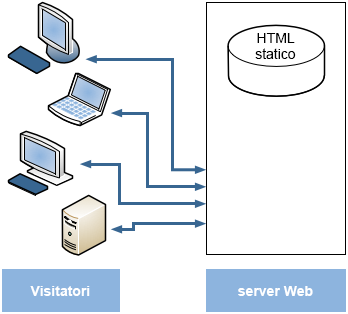
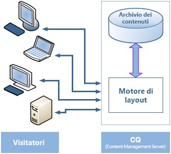
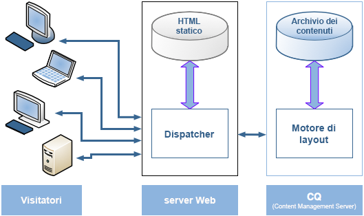
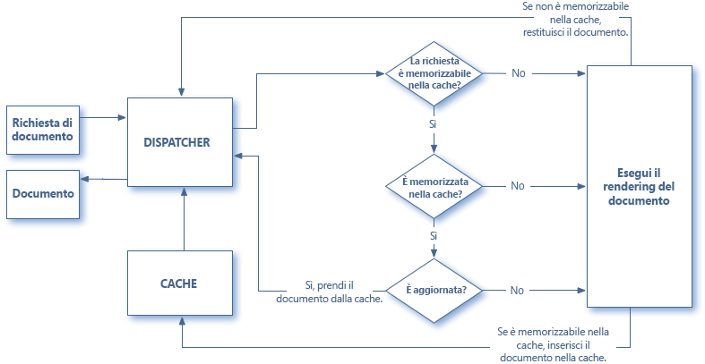
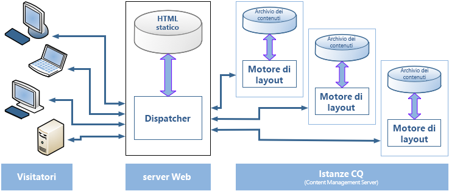

# Panoramica del dispatcher {#dispatcher-overview}

>[!NOTE]
>
>Le versioni del dispatcher sono indipendenti da AEM. Potresti essere stato reindirizzato a questa pagina se hai seguito un collegamento alla documentazione di Dispatcher incorporata nella documentazione per una versione precedente di AEM.

Dispatcher è uno strumento di cache e/o bilanciamento del carico di Adobe Experience Manager. L&#39;utilizzo del dispatcher di AEM contribuisce anche a proteggere il server AEM dall&#39;attacco. Pertanto, potete aumentare la protezione dell&#39;istanza AEM utilizzando il dispatcher insieme a un server Web di classe enterprise.

La procedura per la distribuzione di un dispatcher è indipendente dal server Web e dalla piattaforma OS scelta:

1. Scopri il dispatcher (questa pagina). Inoltre, consultate [le domande frequenti sul dispatcher](https://helpx.adobe.com/experience-manager/using/dispatcher-faq.html).
1. Installate un [server Web supportato](https://helpx.adobe.com/experience-manager/6-3/sites/deploying/using/technical-requirements.html) in base alla documentazione del server Web.

1. [Installate il modulo Dispatcher](dispatcher-install.md) sul server Web e configurate di conseguenza il server Web.
1. [Configura dispatcher](dispatcher-configuration.md) (file dispatcher. any).

1. [Configurate AEM](page-invalidate.md) in modo che gli aggiornamenti del contenuto invalidino la cache.

>[!NOTE]
>
>Per una migliore disattivazione del funzionamento di Dispatcher con AEM, [consulta Ask the AEM Community Experts for July 2017](https://bit.ly/ATACE0717).

Utilizzate le seguenti informazioni come necessario:

* [Elenco di controllo della sicurezza del dispatcher](security-checklist.md)
* [La knowledgebase di Dispatcher](https://helpx.adobe.com/cq/kb/index/dispatcher.html)
* [Ottimizzazione di un sito Web per le prestazioni cache](https://helpx.adobe.com/experience-manager/6-4/sites/deploying/using/configuring-performance.html)
* [Utilizzo di Dispatcher con più domini](dispatcher-domains.md)
* [Utilizzo di SSL con dispatcher](dispatcher-ssl.md)
* [Implementazione di caching sensibile alle autorizzazioni](permissions-cache.md)
* [Risoluzione dei problemi di dispatcher](dispatcher-troubleshooting.md)
* [Domande frequenti sui problemi principali del dispatcher](dispatcher-faq.md)

>[!NOTE]
>
>**L&#39;uso più comune del dispatcher** consiste nel memorizzare nella cache le risposte da un&#39;istanza **** di pubblicazione AEM per migliorare la capacità di risposta e la sicurezza del sito Web pubblicato esternamente. La maggior parte della discussione si concentra su questo caso.
>
>Tuttavia, il dispatcher può essere utilizzato anche per aumentare la capacità di reindirizzamento dell&#39;istanza **di authoring**, in particolare se si dispone di un numero elevato di utenti che modificano e aggiornano il sito Web. Per informazioni dettagliate su questo caso, consultate [Utilizzo di un dispatcher con un server Author](#using-a-dispatcher-with-an-author-server), di seguito.

## Perché usare Dispatcher per implementare il caching? {#why-use-dispatcher-to-implement-caching}

Esistono due approcci fondamentali per la pubblicazione Web:

* **Server Web statici**: Come Apache o IIS, sono molto semplici, ma veloci.
* **Server di gestione dei contenuti**: che forniscono contenuti dinamici, in tempo reale e avanzati, ma richiedono molto più tempo di calcolo e altre risorse.

Il Dispatcher contribuisce a realizzare un ambiente rapido e dinamico. Funziona come parte di un server HTML statico, ad esempio Apache, con l&#39;obiettivo di:

* memorizzazione (o «cache») della maggior parte del contenuto del sito possibile, sotto forma di sito Web statico
* accesso al motore di layout più possibile.

Ovvero:

* **il contenuto** statico viene gestito con la stessa velocità e semplicità di un server Web statico,*inoltre, potete utilizzare gli strumenti di amministrazione e di protezione disponibili per i server Web statici*.

* **il contenuto** dinamico viene generato in base alle esigenze, senza rallentarlo più del necessario.

Il Dispatcher contiene meccanismi per generare e aggiornare HTML statici in base al contenuto del sito dinamico. Potete specificare in dettaglio quali documenti vengono memorizzati come file statici e quali vengono generati in modo dinamico.

Questa sezione descrive i principi sottostanti.

### Server Web statico {#static-web-server}



Un server Web statico, come Apache o IIS, fornisce ai visitatori del sito Web file HTML statici. Le pagine statiche vengono create una volta, pertanto lo stesso contenuto verrà distribuito per ogni richiesta.

Questo processo è molto semplice e quindi molto efficiente. Se un visitatore richiede un file (ad es. una pagina HTML), in genere il file viene portato direttamente dalla memoria, al peggiore della lettura dall&#39;unità locale. I server Web statici sono disponibili per un certo periodo di tempo, pertanto è disponibile un&#39;ampia gamma di strumenti per la gestione e la gestione della sicurezza, che sono perfettamente integrati con le infrastrutture di rete.

### Server di gestione dei contenuti {#content-management-servers}



Se utilizzate un server di gestione dei contenuti, ad esempio AEM, un motore di layout avanzato elabora la richiesta da un visitatore. Il motore legge il contenuto di un archivio che, combinato con stili, formati e diritti di accesso, trasforma il contenuto in un documento in base alle esigenze e ai diritti del visitatore.

Questo consente di creare contenuti dinamici e dinamici, aumentando la flessibilità e la funzionalità del sito Web. Tuttavia, il motore di layout richiede più potenza di elaborazione rispetto a un server statico, pertanto questa configurazione potrebbe essere rallentata se molti visitatori utilizzano il sistema.

## Come navigare nella cache {#how-dispatcher-performs-caching}



**La directory Cache** per il caching, il modulo Dispatcher utilizza la capacità del server Web di distribuire contenuto statico. Il dispatcher colloca i documenti memorizzati nella cache nella directory principale del documento del server Web.

>[!NOTE]
>
>Se non viene utilizzata la configurazione per il caching delle intestazioni HTTP, il dispatcher memorizza solo il codice HTML della pagina, non memorizza le intestazioni HTTP. Questo può essere un problema se utilizzate codifiche diverse all&#39;interno del sito Web, in quanto potrebbero perdersi. Per attivare il caching delle intestazioni HTTP, consultate [Configurazione della cache del dispatcher.](https://helpx.adobe.com/experience-manager/dispatcher/using/dispatcher-configuration.html)

>[!NOTE]
>
>La localizzazione della radice del documento del server Web su memorizzazione collegata alla rete (NAS) causa il degrado delle prestazioni. Inoltre, quando una radice del documento che si trova su NAS viene condivisa tra più server Web, si possono verificare blocchi intermittenti quando vengono eseguite le azioni di replica.

>[!NOTE]
>
>Il dispatcher memorizza il documento memorizzato nella cache in una struttura uguale all&#39;URL richiesto.
>
>Per il nome del file possono essere presenti limitazioni a livello di sistema operativo; ad esempio, se disponete di un URL con molti selettori.

### Metodi per il caching

Il dispatcher dispone di due metodi principali per aggiornare il contenuto della cache quando vengono apportate modifiche al sito Web.

* **Aggiornamenti** dei contenuti rimuove le pagine modificate e i file direttamente associati.
* **Annulla validità automatica** invalida automaticamente le parti della cache che potrebbero non essere aggiornate dopo un aggiornamento. ad esempio, contrassegna le pagine pertinenti come non aggiornate, senza eliminare nulla.

### Aggiornamenti dei contenuti

In un aggiornamento del contenuto, uno o più documenti AEM cambiano. AEM invia una richiesta di sindacazione al dispatcher, che aggiorna la cache di conseguenza:

1. Elimina i file modificati dalla cache.
1. Elimina tutti i file che iniziano con la stessa maniglia dalla cache. Ad esempio, se il file /en/index.html viene aggiornato, tutti i file che iniziano con /en/index. vengono eliminati. Questo meccanismo consente di progettare siti con efficienza cache, in particolare per quanto riguarda le navigazione delle immagini.
1. *Tocca* il **file statico**, Questo aggiorna la marca temporale del statfile statico per indicare la data dell&#39;ultima modifica.

Sono indicati i punti seguenti:

* Gli aggiornamenti dei contenuti vengono in genere utilizzati insieme a un sistema di authoring che «conosce» ciò che deve essere sostituito.
* I file interessati da un aggiornamento del contenuto vengono rimossi, ma non sostituiti immediatamente. Alla successiva richiesta di tale file, il dispatcher recupera il nuovo file dall&#39;istanza AEM e lo posiziona nella cache, sovrascrivendo il contenuto precedente.
* In genere, le immagini generate automaticamente che incorporano testo da una pagina sono memorizzate in file illustrazione che iniziano con la stessa mano, assicurando così l&#39;esistenza dell&#39;associazione per l&#39;eliminazione. Ad esempio, potete memorizzare il testo del titolo della pagina mypage.html come immagine mypage. titlepicture. gif nella stessa cartella. In questo modo l&#39;immagine viene eliminata automaticamente dalla cache ogni volta che la pagina viene aggiornata, quindi potete essere certi che l&#39;immagine rifletta sempre la versione corrente della pagina.
* Potreste avere più file statici, ad esempio una per lingua. Se una pagina viene aggiornata, AEM cerca la cartella principale successiva contenente un statfile statico e *lo tocca* .

### Annullamento automatico

La convalida automatica invalida automaticamente parti della cache senza eliminare fisicamente i file. A ogni aggiornamento del contenuto, il file statico viene toccato e la sua marca temporale riflette l&#39;ultimo aggiornamento del contenuto.

Il dispatcher dispone di un elenco di file soggetti a annullamento automatico. Quando viene richiesto un documento di tale elenco, il dispatcher confronta la data del documento memorizzato nella cache con la marca temporale del statfile statico:

* se il documento memorizzato nella cache è più recente, il dispatcher la restituisce.
* se è precedente, il dispatcher recupera la versione corrente dall&#39;istanza AEM.

Di nuovo, sono indicati alcuni punti:

* La convalida automatica viene generalmente utilizzata quando le interattività sono complesse, ad esempio per le pagine HTML. Queste pagine contengono collegamenti e voci di navigazione, quindi in genere devono essere aggiornate dopo un aggiornamento del contenuto. Se sono stati generati automaticamente file PDF o illustrazione, potete scegliere di annullarne la validità automaticamente.
* L&#39;annullamento automatico non implica l&#39;azione da parte del dispatcher al momento dell&#39;aggiornamento, ad eccezione del tocco del file statico. Tuttavia, toccando il file statico viene renderizzato automaticamente il contenuto della cache, senza rimuovere fisicamente dalla cache.

## Restituzione di documenti da parte del dispatcher {#how-dispatcher-returns-documents}



### Determinare se un documento è soggetto a caching

[Potete definire quali documenti vengono memorizzati nella cache del dispatcher nel file di configurazione](https://helpx.adobe.com/experience-manager/dispatcher/using/dispatcher-configuration.html). Il dispatcher verifica la richiesta rispetto all&#39;elenco di documenti CACHABLE. Se il documento non è presente in questo elenco, il dispatcher richiede il documento dall&#39;istanza AEM.

Il dispatcher *richiede sempre* il documento direttamente dall&#39;istanza AEM nei casi seguenti:

* Se l&#39;URI di richiesta contiene un punto interrogativo &quot;?&quot;. In genere indica una pagina dinamica, ad esempio un risultato di ricerca, che non deve essere memorizzata nella cache.
* L&#39;estensione del file è mancante. Il server Web richiede l&#39;estensione per determinare il tipo di documento (tipo MIME).
* L&#39;intestazione di autenticazione è impostata (può essere configurata)

>[!NOTE]
>
>I metodi GET o HEAD (per i metodi dell&#39;intestazione HTTP) possono essere memorizzati nella cache dal dispatcher. Per ulteriori informazioni sul caching delle intestazioni della risposta, consultate la [sezione Intestazioni](https://helpx.adobe.com/experience-manager/dispatcher/using/dispatcher-configuration.html) risposta HTTP.

### Determinare se un documento è memorizzato nella cache

Il Dispatcher memorizza i file memorizzati nella cache sul server Web come se fossero parte di un sito Web statico. Se un utente richiede un documento cachable, il dispatcher verifica se tale documento esiste nel file system del server Web:

* se il documento è memorizzato nella cache, il dispatcher restituisce il file.
* se non viene memorizzata nella cache, il dispatcher richiede il documento dall&#39;istanza AEM.

### Determinare se un documento è aggiornato

Per verificare se un documento è aggiornato, il dispatcher esegue due passaggi:

1. Controlla se il documento è soggetto a annullamento automatico del documento. In caso contrario, il documento viene considerato aggiornato.
1. Se il documento è configurato per la cancellazione automatica, il dispatcher verifica se è precedente o più recente dell&#39;ultima modifica disponibile. Se è precedente, il dispatcher richiede la versione corrente dall&#39;istanza AEM e sostituisce la versione nella cache.

>[!NOTE]
>
>Documents without **auto-invalidation** remain in the cache until they are physically deleted; e.g. by a content update on the web site.

## Vantaggi del bilanciamento del carico {#the-benefits-of-load-balancing}

Il bilanciamento del carico è utile per distribuire il carico computazionale del sito Web in diverse istanze di AEM.



Ottieni:

* **potenza
elaborazione incrementata** In pratica Ciò significa che il Dispatcher condivide le richieste del documento tra più istanze di AEM. Poiché ogni istanza ora dispone di un numero inferiore di documenti da elaborare, si ottengono tempi di risposta più rapidi. Il dispatcher mantiene statistiche interne per ogni categoria di documenti, in modo da stimare il carico e distribuire le query in modo efficiente.

* **copertura
non corretta:** se il Dispatcher non riceve le risposte da un&#39;istanza, ripeterà automaticamente le richieste a una delle altre istanze. Pertanto, se un&#39;istanza diventa non disponibile, l&#39;unico effetto è un rallentamento del sito, proporzionali alla potenza computazionale persa. Tuttavia, tutti i servizi continueranno.

* Potete inoltre gestire siti Web diversi sullo stesso server Web statico.

>[!NOTE]
>
>Quando il bilanciamento del carico distribuisce il carico in modo efficiente, la memorizzazione nella cache contribuisce a ridurre il carico. Pertanto, provate a ottimizzare il caching e a ridurre il carico complessivo prima di configurare il bilanciamento del carico. Una buona memorizzazione nella cache può migliorare le prestazioni del sistema di bilanciamento del carico o rendere superflua il bilanciamento del carico.

>[!CAUTION]
>
>Sebbene un singolo Dispatcher possa in genere saturare la capacità delle istanze Pubblicate disponibili, per alcune rare applicazioni potrebbe essere sensato bilanciare anche il carico tra due istanze del dispatcher. Le configurazioni con più dispatcher devono essere considerate attentamente, perché un Dispatcher aggiuntivo aumenterà il carico nelle istanze pubblicate e può facilmente diminuire le prestazioni nella maggior parte delle applicazioni.

## Modalità in cui il dispatcher esegue il bilanciamento del carico {#how-the-dispatcher-performs-load-balancing}

### Statistiche di prestazioni

Il Dispatcher mantiene statistiche interne sulla rapidità con cui ogni istanza di AEM elabora i documenti. In base a tali dati, il dispatcher stima quale istanza fornirà il tempo di risposta più rapido durante la risposta a una richiesta, in modo che si riservi il tempo di calcolo necessario nell&#39;istanza.

Diversi tipi di richieste possono presentare diverse ore di completamento medie, per cui il dispatcher consente di specificare le categorie dei documenti. Questi vengono quindi considerati quando si calcolano le stime temporali. Ad esempio, è possibile distinguere tra pagine HTML e immagini, in quanto i tempi di risposta tipici possono essere molto diversi.

Se utilizzate una funzione di ricerca elaborata, potete creare una nuova categoria per le query di ricerca. Questo consente al dispatcher di inviare query di ricerca all&#39;istanza che risponde più velocemente. Questo impedisce l&#39;allineamento di un&#39;istanza più lenta quando riceve diverse query di ricerca «costose», mentre gli altri ottengono le richieste &quot;più economiche&quot;.

### Contenuto personalizzato (connessioni fissi)

Le connessioni fisso garantiscono che i documenti per un utente siano tutti composti sulla stessa istanza di AEM. Questo è importante se usi pagine personalizzate e dati di sessione. I dati vengono memorizzati nell&#39;istanza, pertanto le richieste successive dello stesso utente devono restituire tale istanza oppure i dati vanno persi.

Poiché le connessioni fisso limitano la capacità del dispatcher di ottimizzare le richieste, è necessario utilizzarle solo se necessario. Potete specificare la cartella che contiene i documenti «fisso», in modo che tutti i documenti della cartella siano composti sulla stessa istanza per ogni utente.

>[!NOTE]
>
>Per la maggior parte delle pagine che utilizzano connessioni fisso è necessario disattivare la memorizzazione nella cache; in caso contrario la pagina avrà lo stesso aspetto a tutti gli utenti, indipendentemente dal contenuto della sessione.
>
>Per *alcune* applicazioni è possibile utilizzare sia collegamenti fissi che caching; ad esempio, se si visualizza un modulo che scrive dati nella sessione.

## Utilizzo di più dispatcher {#using-multiple-dispatchers}

In configurazioni complesse è possibile utilizzare più Dispatcher. Ad esempio, è possibile utilizzare:

* un dispatcher per pubblicare un sito Web nella rete Intranet
* un secondo Dispatcher, con un indirizzo diverso e con impostazioni di sicurezza diverse, per pubblicare lo stesso contenuto su Internet.

In tal caso, accertatevi che ogni richiesta sia attraversata da un solo dispatcher. Un dispatcher non gestisce le richieste derivanti da un altro dispatcher. Assicuratevi quindi che entrambi i dispatcher accedano direttamente al sito Web AEM.

## Utilizzo di Dispatcher con una rete CDN {#using-dispatcher-with-a-cdn}

Una rete di distribuzione dei contenuti (CDN), ad esempio Akamai Edge Delivery o Amazon Cloud Front, distribuisce il contenuto da una posizione vicina all&#39;utente finale. Tramite che

* velocizza i tempi di risposta per gli utenti finali
* viene caricato dai server

Come componente dell&#39;infrastruttura HTTP, una CDN funziona come Dispatcher: quando un nodo CDN riceve una richiesta, la richiesta viene usata dalla cache, se possibile (la risorsa è disponibile nella cache ed è valida). In caso contrario, arriva al server più vicino successivo per recuperare la risorsa e memorizzarla nella cache per ulteriori richieste, se appropriato.

Il &quot;server più prossimo più vicino&quot; dipende dalla configurazione specifica. Ad esempio, in un&#39;installazione di Akamai la richiesta può seguire il seguente percorso:

* Il nodo Akamai Edge
* Il livello Akamai Midgres
* Firewall
* Il sistema di bilanciamento del carico
* Dispatcher
* AEM

Nella maggior parte dei casi, Dispatcher è il server successivo che potrebbe servire il documento da una cache e influenzare le intestazioni di risposta restituite al server CDN.

## Controllo di una cache CDN {#controlling-a-cdn-cache}

Esiste un numero di modi per controllare per quanto tempo una rete CDN memorizzerà una risorsa prima di recuperarla dal dispatcher.

1. Configurazione esplicita\
   Configura, il tempo di permanenza delle risorse in cache CDN, a seconda del tipo mime, dell&#39;estensione, del tipo di richiesta, ecc.

1. Intestazioni di scadenza e controllo cache\
   La maggior parte dei CDNS prevarranno `Expires:` e `Cache-Control:` le intestazioni HTTP se inviate dal server upstream. Questo può essere ottenuto, ad esempio utilizzando [il modulo mod_ expires](https://httpd.apache.org/docs/2.2/mod/mod_expires.html) Apache.

1. Annullamento manuale\
   I CDNS consentono la rimozione delle risorse dalla cache attraverso le interfacce Web.
1. Annullamento della validità delle API\
   La maggior parte dei CDNS offre inoltre un&#39;API REST e/o SOAP che consente la rimozione delle risorse dalla cache.

In una configurazione standard di AEM, la configurazione per estensione e/o percorso, che è possibile raggiungere mediante i punti 1 e 2 qui sopra, offre possibilità per impostare periodi di caching ragionevoli per risorse spesso utilizzate che non vengono spesso modificate, come immagini di progettazione e librerie client. Quando vengono distribuite nuove versioni, in genere è necessaria una convalida manuale.

Se questo approccio viene utilizzato per memorizzare nella cache il contenuto gestito, significa che le modifiche dei contenuti sono visibili solo agli utenti finali una volta scaduto il periodo di caching configurato e il documento viene recuperato di nuovo dal dispatcher.

Per un controllo più preciso, l&#39;annullamento della validità delle API consente di annullare la validità di una cache CDN durante la validità della cache del dispatcher. In base all&#39;API cdns, potete implementare i propri [contentbuilder](https://docs.adobe.com/docs/en/cq/current/javadoc/com/day/cq/replication/ContentBuilder.html) e [transporthandler](https://docs.adobe.com/docs/en/cq/current/javadoc/com/day/cq/replication/TransportHandler.html) (se l&#39;API non è basata su REST) e impostare un agente di replica che utilizzerà per annullare la validità della cache CDN.

>[!NOTE]
>
>Consultate anche [AEM (CQ) Dispatcher Security and CDN + Browser Caching](https://www.slideshare.net/andrewmkhoury/dispatcher-caching-aemgemspart2jan2015) and registered presentation on [Dispatcher Caching](https://docs.adobe.com/content/ddc/en/gems/dispatcher-caching---new-features-and-optimizations.html).

## Utilizzo di un dispatcher con un server autore {#using-a-dispatcher-with-an-author-server}

>[!CAUTION]
>
>se utilizzate [AEM con l&#39;interfaccia utente](https://helpx.adobe.com/experience-manager/6-3/sites/developing/using/touch-ui-concepts.html) Touch, **non** dovreste memorizzare nella cache il contenuto dell&#39;istanza di authoring. Se la memorizzazione nella cache è stata abilitata per l&#39;istanza di creazione, è necessario disattivarla ed eliminarne il contenuto. Per disattivare il caching, modificare il `author_dispatcher.any` file e modificare `/rule` la proprietà `/cache` della sezione come segue:

```xml
/rules
{
/0000
{ /type "deny" /glob "*"}
}
```

Un dispatcher può essere utilizzato davanti a un&#39;istanza di authoring per migliorare le prestazioni di authoring. Per configurare un dispatcher di authoring, effettua le operazioni seguenti:

1. Installate un dispatcher in un server Web (potrebbe trattarsi del server Web Apache o IIS, consultate [Installazione del dispatcher](dispatcher-install.md)).
1. Potresti voler testare il dispatcher appena installato rispetto a un&#39;istanza di pubblicazione AEM funzionante, per verificare che sia stata aggiunta un&#39;installazione corretta alla linea di base.
1. Accertatevi ora che il dispatcher sia in grado di connettersi tramite TCP/IP all&#39;istanza di authoring.
1. Sostituisci il dispatcher di esempio. qualsiasi file con autore_ dispatcher. Qualsiasi file fornito con [lo scaricatore del dispatcher](release-notes.md#downloads).
1. Aprite l&#39; `author_dispatcher.any` editor di testo e apportate le seguenti modifiche:

   1. Modificate la `/hostname` sezione e `/port` la `/renders` sezione in modo che puntino all&#39;istanza di authoring.
   1. Modificate la `/docroot``/cache` sezione in modo che punti a una directory della cache. Se utilizzi [AEM con l&#39;interfaccia utente touch](https://helpx.adobe.com/experience-manager/6-3/sites/developing/using/touch-ui-concepts.html), vedi l&#39;avviso precedente.
   1. Salvate le modifiche.

1. Eliminate tutti i file esistenti nella directory `/cache` &gt; `/docroot` che avete configurato qui sopra.
1. Riavviate il server Web.

>[!NOTE]
>
>Tenete presente che con `author_dispatcher.any` la configurazione fornita, quando installate un pacchetto di funzioni CQ 5, hotfix o pacchetto di codice dell&#39;applicazione che influisce su qualsiasi contenuto sotto `/libs` o `/apps` poi dovete eliminare i file memorizzati nella cache all&#39;interno di tali directory nella cache del dispatcher, per assicurarsi che alla successiva richiesta vengano estratti i file aggiornati di recente, e non quelli precedenti.

>[!CAUTION]
>
>Se avete utilizzato il dispatcher autore configurato in precedenza e avete abilitato un *agente* di eliminazione del dispatcher, effettuate le seguenti operazioni:

1. Elimina o disabilita l&#39; **agente** di cancellazione dell&#39;autore nell&#39;istanza di creazione AEM.
1. Ripristina la configurazione di dispatcher dell&#39;autore seguendo le istruzioni riportate di seguito.

<!--
[Author Dispatcher configuration file (Dispatcher 4.1.2 or later)](assets/author_dispatchernew.any)
-->
<!--[!NOTE]
>
>A related knowledge base article can be found here:  
>[How to configure the dispatcher in front of an authoring environment](https://helpx.adobe.com/cq/kb/HowToConfigureDispatcherForAuthoringEnvironment.html)
-->
