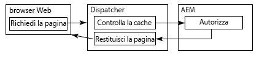
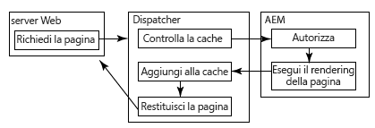
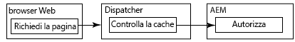

# Caching di contenuto protetto {#caching-secured-content}

Il caching sensibile alle autorizzazioni consente di memorizzare in cache le pagine protette. Dispatcher controlla che l’utente sia autorizzato ad accedere a una pagina memorizzata in cache prima di distribuirla.

Dispatcher include il modulo AuthChecker che implementa il caching sensibile alle autorizzazioni. Quando il modulo viene attivato, il rendering richiama un servlet AEM per eseguire l’autenticazione e l’autorizzazione dell’utente per il contenuto richiesto. La risposta del servlet determina se il contenuto viene distribuito al browser web.

Poiché i metodi di autenticazione e autorizzazione sono specifici per la distribuzione AEM, è assolutamente necessario creare il servlet.

>[!NOTE]
>
>Utilizza i filtri `deny` per applicare le restrizioni di sicurezza predefinite. Utilizza il caching sensibile alle autorizzazioni per le pagine configurate per consentire l’accesso a un sottoinsieme di utenti o gruppi.

I diagrammi seguenti illustrano l’ordine degli eventi che si verificano quando un browser web richiede una pagina per la quale viene utilizzato il caching sensibile alle autorizzazioni.

## La pagina viene memorizzata in cache e l’utente viene autorizzato {#page-is-cached-and-user-is-authorized}



1. Dispatcher stabilisce che il contenuto richiesto è memorizzato in cache ed è valido.
1. Dispatcher invia un messaggio di richiesta al rendering. La sezione HEAD include tutte le righe di intestazione della richiesta del browser.
1. Il rendering richiama il servlet di authoring per eseguire il controllo di sicurezza e risponde a Dispatcher. Il messaggio di risposta include il codice di stato HTTP 200 per indicare che l’utente è autorizzato.
1. Dispatcher invia al browser un messaggio di risposta costituito dalle righe di intestazione della risposta del rendering e dal contenuto memorizzato in cache come corpo del messaggio.

## La pagina non viene memorizzata in cache e l’utente viene autorizzato {#page-is-not-cached-and-user-is-authorized}



1. Dispatcher stabilisce che il contenuto non viene memorizzato in cache o che richiede un aggiornamento.
1. Dispatcher inoltra la richiesta originale al rendering.
1. Il rendering richiama il servlet di authoring per eseguire un controllo di sicurezza. Quando l’utente viene autorizzato, il rendering include la pagina sottoposta a rendering nel corpo del messaggio di risposta.
1. Dispatcher inoltra la risposta al browser. Dispatcher memorizza in cache il corpo del messaggio di risposta del rendering.

## L’utente non viene autorizzato {#user-is-not-authorized}



1. Dispatcher controlla la cache.
1. Dispatcher invia al rendering un messaggio di richiesta che include tutte le righe di intestazione della richiesta del browser.
1. Il rendering richiama il servlet di authoring per eseguire un controllo di sicurezza che ha esito negativo e inoltra la richiesta originale a Dispatcher.

## Implementazione del caching sensibile alle autorizzazioni {#implementing-permission-sensitive-caching}

Per implementare il caching sensibile alle autorizzazioni, esegui le operazioni sotto riportate:

* Sviluppa un servlet che esegua l’autenticazione e l’autorizzazione
* Configura Dispatcher

>[!NOTE]
>
>In genere, le risorse protette vengono memorizzate in una cartella separata rispetto ai file non protetti. Ad esempio, /contenuto/protetto/


## Crea il servlet di autorizzazione {#create-the-authorization-servlet}

Crea e distribuisci un servlet che esegua l’autenticazione e l’autorizzazione dell’utente che richiede il contenuto web. Il servlet può utilizzare qualsiasi metodo di autenticazione e autorizzazione, come l’account utente AEM e le ACL dell’archivio oppure un servizio di ricerca LDAP. Distribuisci il servlet all’istanza AEM utilizzata da Dispatcher come rendering.

Il servlet deve essere accessibile a tutti gli utenti. Pertanto, il tuo servlet deve estendere la classe `org.apache.sling.api.servlets.SlingSafeMethodsServlet` che fornisce l’accesso in sola lettura al sistema.

Il servlet riceve solo richieste HEAD dal rendering, pertanto devi semplicemente implementare il metodo `doHead`.

Il rendering include l’URI della risorsa richiesta come parametro della richiesta HTTP. Ad esempio, un servlet di autorizzazione è accessibile tramite `/bin/permissioncheck`. Per eseguire un controllo di sicurezza sulla pagina /content/geometrixx-outdoors/en.html, il rendering include il seguente URL nella richiesta HTTP:

`/bin/permissioncheck?uri=/content/geometrixx-outdoors/en.html`

Il messaggio di risposta del servlet deve contenere i seguenti codici di stato HTTP:

* 200: autenticazione e autorizzazione eseguite con esito positivo.

Il seguente esempio di servlet ottiene l’URL della risorsa richiesta dalla richiesta HTTP. Il codice utilizza l’annotazione Felix SCR `Property` per impostare il valore della proprietà `sling.servlet.paths` su /bin/permissioncheck. Nel metodo `doHead`, il servlet ottiene l’oggetto sessione e utilizza il metodo `checkPermission` per determinare il codice di risposta appropriato.

>[!NOTE]
>
>Il valore della proprietà sling.servlet.paths deve essere abilitato nel servizio Sling Servlet Resolver (org.apache.sling.servlets.resolver.SlingServletResolver).

### Esempio di servlet {#example-servlet}

```java
package com.adobe.example;

import org.apache.felix.scr.annotations.Component;
import org.apache.felix.scr.annotations.Service;
import org.apache.felix.scr.annotations.Property;

import org.apache.sling.api.SlingHttpServletRequest;
import org.apache.sling.api.SlingHttpServletResponse;
import org.apache.sling.api.servlets.SlingSafeMethodsServlet;

import org.slf4j.Logger;
import org.slf4j.LoggerFactory;

import javax.jcr.Session;

@Component(metatype=false)
@Service
public class AuthcheckerServlet extends SlingSafeMethodsServlet {
 
    @Property(value="/bin/permissioncheck")
    static final String SERVLET_PATH="sling.servlet.paths";
    
    private Logger logger = LoggerFactory.getLogger(this.getClass());
    
    public void doHead(SlingHttpServletRequest request, SlingHttpServletResponse response) {
     try{ 
      //retrieve the requested URL
      String uri = request.getParameter("uri");
      //obtain the session from the request
      Session session = request.getResourceResolver().adaptTo(javax.jcr.Session.class);     
      //perform the permissions check
      try {
       session.checkPermission(uri, Session.ACTION_READ);
       logger.info("authchecker says OK");
       response.setStatus(SlingHttpServletResponse.SC_OK);
      } catch(Exception e) {
       logger.info("authchecker says READ access DENIED!");
       response.setStatus(SlingHttpServletResponse.SC_FORBIDDEN);
      }
     }catch(Exception e){
      logger.error("authchecker servlet exception: " + e.getMessage());
     }
    }
}
```

## Configura Dispatcher per il caching sensibile alle autorizzazioni {#configure-dispatcher-for-permission-sensitive-caching}

La sezione auth_checker del file dispatcher.any controlla il comportamento del caching sensibile alle autorizzazioni. La sezione auth_checker include le seguenti sottosezioni:

* `url`: il valore della proprietà `sling.servlet.paths` del servlet che esegue il controllo di sicurezza.

* `filter`: filtri che specificano le cartelle alle quali viene applicato il caching sensibile alle autorizzazioni. In genere, il filtro `deny` viene applicato a tutte le cartelle, mentre i filtri `allow` vengono applicati alle cartelle protette.

* `headers`: specifica le intestazioni HTTP che il servlet di autorizzazione include nella risposta.

Quando Dispatcher viene avviato, il file di registro di Dispatcher include il seguente messaggio a livello di debug:

`AuthChecker: initialized with URL 'configured_url'.`

Nell’esempio che segue, la sezione auth_checker configura Dispatcher per l’utilizzo del servlet trattato nell’argomento precedente. La sezione dei filtri stabilisce che i controlli delle autorizzazioni vengano eseguiti solo sulle risorse HTML protette.

### Esempio di configurazione {#example-configuration}

```xml
/auth_checker
  {
  # request is sent to this URL with '?uri=<page>' appended
  /url "/bin/permissioncheck"
      
  # only the requested pages matching the filter section below are checked,
  # all other pages get delivered unchecked
  /filter
    {
    /0000
      {
      /glob "*"
      /type "deny"
      }
    /0001
      {
      /glob "/content/secure/*.html"
      /type "allow"
      }
    }
  # any header line returned from the auth_checker's HEAD request matching
  # the section below will be returned as well
  /headers
    {
    /0000
      {
      /glob "*"
      /type "deny"
      }
    /0001
      {
      /glob "Set-Cookie:*"
      /type "allow"
      }
    }
  }
```
